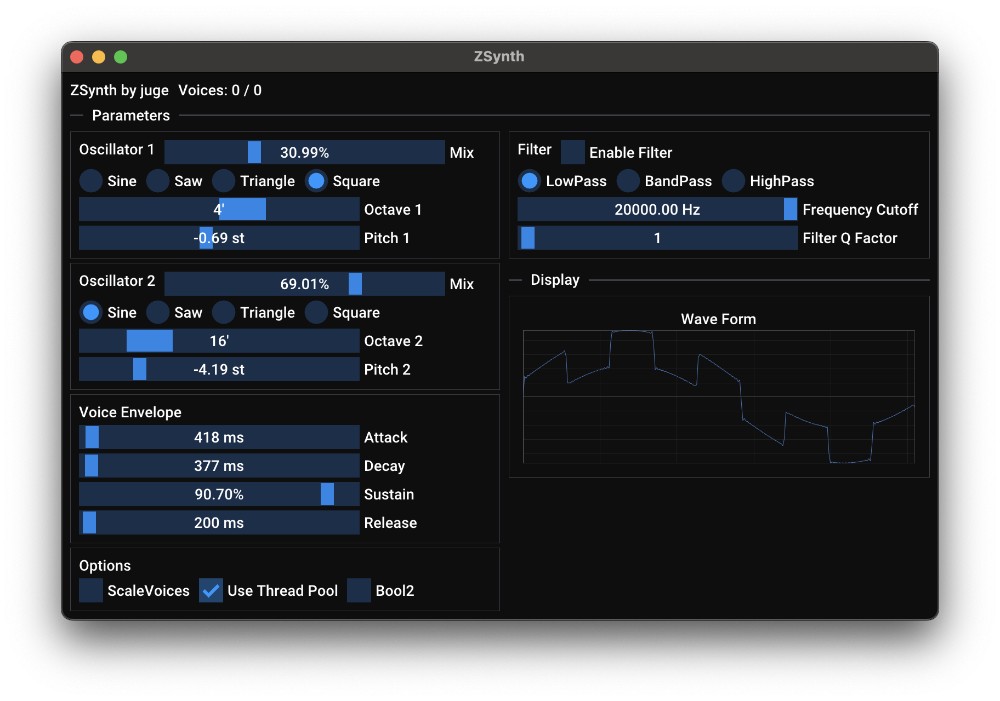

ZSynth is a light-weight digital synthesizer audio plugin written in [Zig](https://github.com/ziglang/zig).
It uses
Zig-friendly [CLAP](https://github.com/free-audio/clap) [bindings](https://git.sr.ht/~interpunct/clap-zig-bindings), and
leverages ImGui to render the plugin GUI.

## Features

- Very lightweight CPU load
- 2 oscillators powered by (mostly) anti-aliased wave tables: Sine, Saw, Triangle, Square
- Intuitive GUI with accurate visual of waveform
- WIP: Filtering
- ADSR with flexibility within a time domain of 0ms to 20s
- Optional compile-time embedding of wave tables, virtually no CPU overhead incurred.
- No oversampling or trigonometric functions during runtime.

## Planned Work

This is just a hobby project / proof of concept for now, but I have some grand designs regardless:

- Perfectly anti-aliased oscillators
- Custom wave table integration
- On-board delay and reverb

## Installation

### Prerequisites

- ZSynth requires Zig nightly. It was last tested with version `0.14.0-dev.2546+0ff0bdb4a`
- Git

### Steps

1. Clone the repository and any submodules with `git clone https://github.com/jrachele/zsynth.git`
2. Run `zig build -Doptimize=ReleaseFast` to generate the CLAP plugin. It will be in the `zig-out/lib` folder.
    - Optionally, if you want to embed the wave tables into the binary directly at compile time, run
      `zig build -Doptimize=ReleaseFast -Dgenerate_wavetables_comptime=true` instead.
3. Move the resulting `ZSynth.clap` plugin to your DAW's CLAP plugin folder. You may need to rename the file extension
   from `.dll` or `.so` to `.clap`